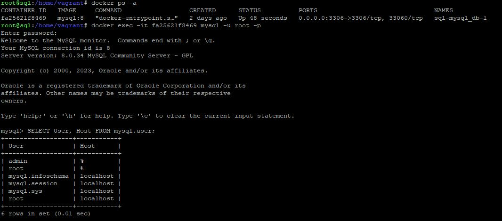
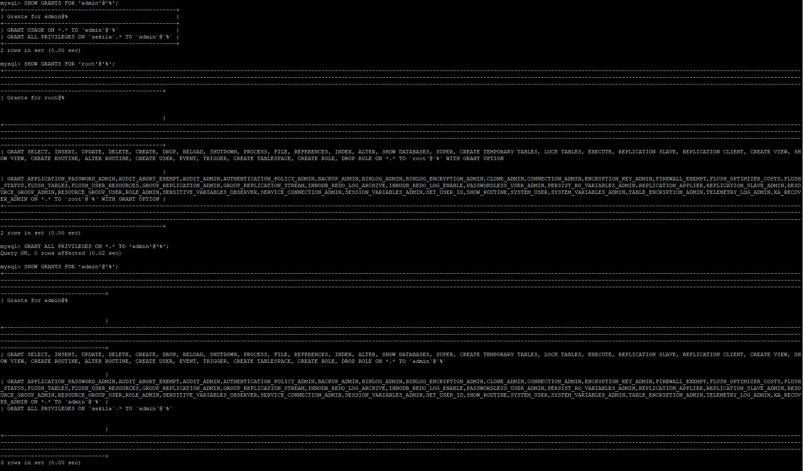
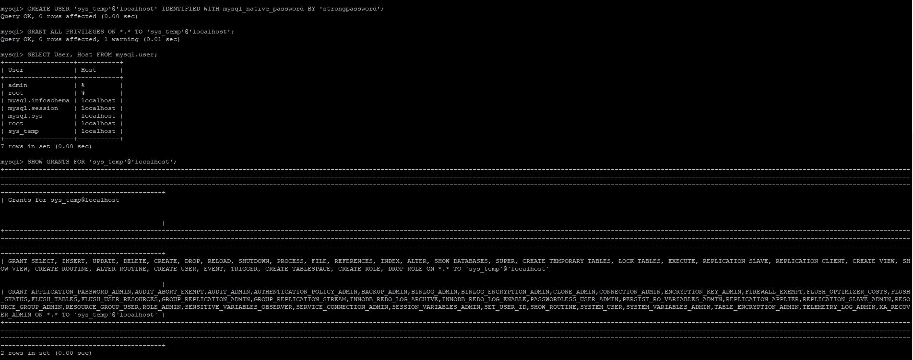
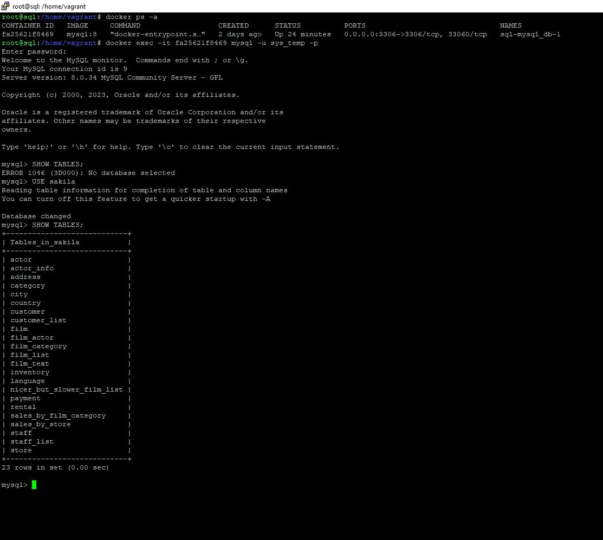

# Домашнее задание к занятию «Работа с данными (DDL/DML)», Лебедев А. И., FOPS-10


---

Задание можно выполнить как в любом IDE, так и в командной строке.

### Задание 1
1.1. Поднимите чистый инстанс MySQL версии 8.0+. Можно использовать локальный сервер или контейнер Docker.

1.2. Создайте учётную запись sys_temp. 

1.3. Выполните запрос на получение списка пользователей в базе данных. (скриншот)

1.4. Дайте все права для пользователя sys_temp. 

1.5. Выполните запрос на получение списка прав для пользователя sys_temp. (скриншот)

1.6. Переподключитесь к базе данных от имени sys_temp.

Для смены типа аутентификации с sha2 используйте запрос: 
```sql
ALTER USER 'sys_test'@'localhost' IDENTIFIED WITH mysql_native_password BY 'password';
```
1.6. По ссылке https://downloads.mysql.com/docs/sakila-db.zip скачайте дамп базы данных.

1.7. Восстановите дамп в базу данных.

1.8. При работе в IDE сформируйте ER-диаграмму получившейся базы данных. При работе в командной строке используйте команду для получения всех таблиц базы данных. (скриншот)

*Результатом работы должны быть скриншоты обозначенных заданий, а также простыня со всеми запросами.*  


### Решение:    

- Так как я начал этот модуль с выполнения задания 12-03 (то есть, следующего за этим), у меня уже есть контейнер с MySQL и туда добавлены пользователи root и admin.

- Давайте выведем список всех пользователей моей БД:

   

- Поиграемся с пользователем admin (у него, а я уже это знаю, прав на работу с БД не достаточно), посмотрим его права, посмотрим права пользователя root, раздадим полные права пользователю admin:

  

- Т.к. по условию задания нам нужно создать нового пользователя - создадим его и дадим, также, все права:

   

- Дамп базы данных уже был скачан и скопирован в MySQL при помощи команд:

```
bash-4.4# mysql -u root -p sakila < sakila-schema.sql
Enter password:
bash-4.4# mysql -u root -p sakila < sakila-data.sql
Enter password:
```

- Зайдем в базу под вновь созданным пользователем и посмотрим, видим ли мы ее:

  

Все супер!

---

### Задание 2
Составьте таблицу, используя любой текстовый редактор или Excel, в которой должно быть два столбца: в первом должны быть названия таблиц восстановленной базы, во втором названия первичных ключей этих таблиц. Пример: (скриншот/текст)
```
Название таблицы | Название первичного ключа
customer         | customer_id
```

### Решение:  

---


## Дополнительные задания (со звёздочкой*)
Эти задания дополнительные, то есть не обязательные к выполнению, и никак не повлияют на получение вами зачёта по этому домашнему заданию. Вы можете их выполнить, если хотите глубже шире разобраться в материале.

### Задание 3*
3.1. Уберите у пользователя sys_temp права на внесение, изменение и удаление данных из базы sakila.

3.2. Выполните запрос на получение списка прав для пользователя sys_temp. (скриншот)

*Результатом работы должны быть скриншоты обозначенных заданий, а также простыня со всеми запросами.*
